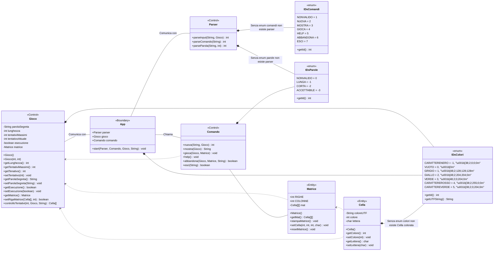
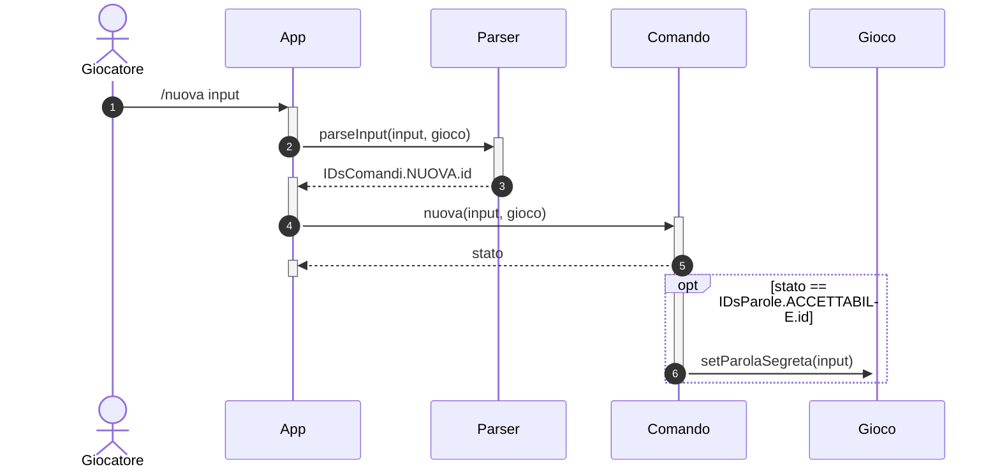
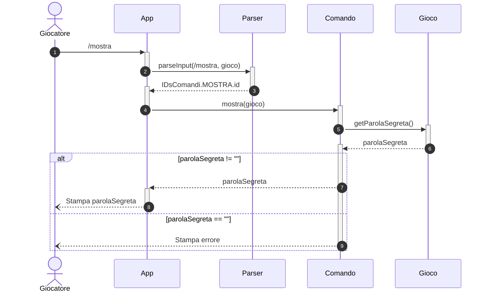
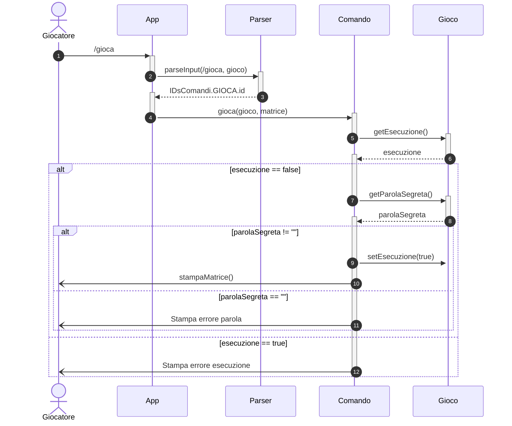
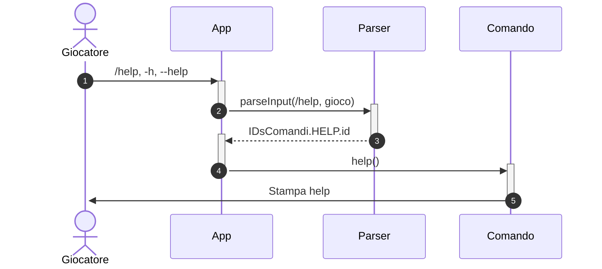
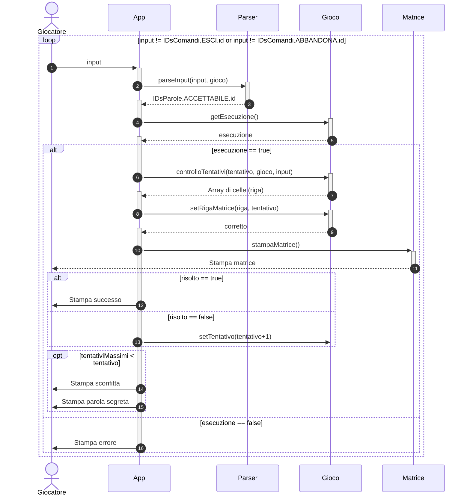
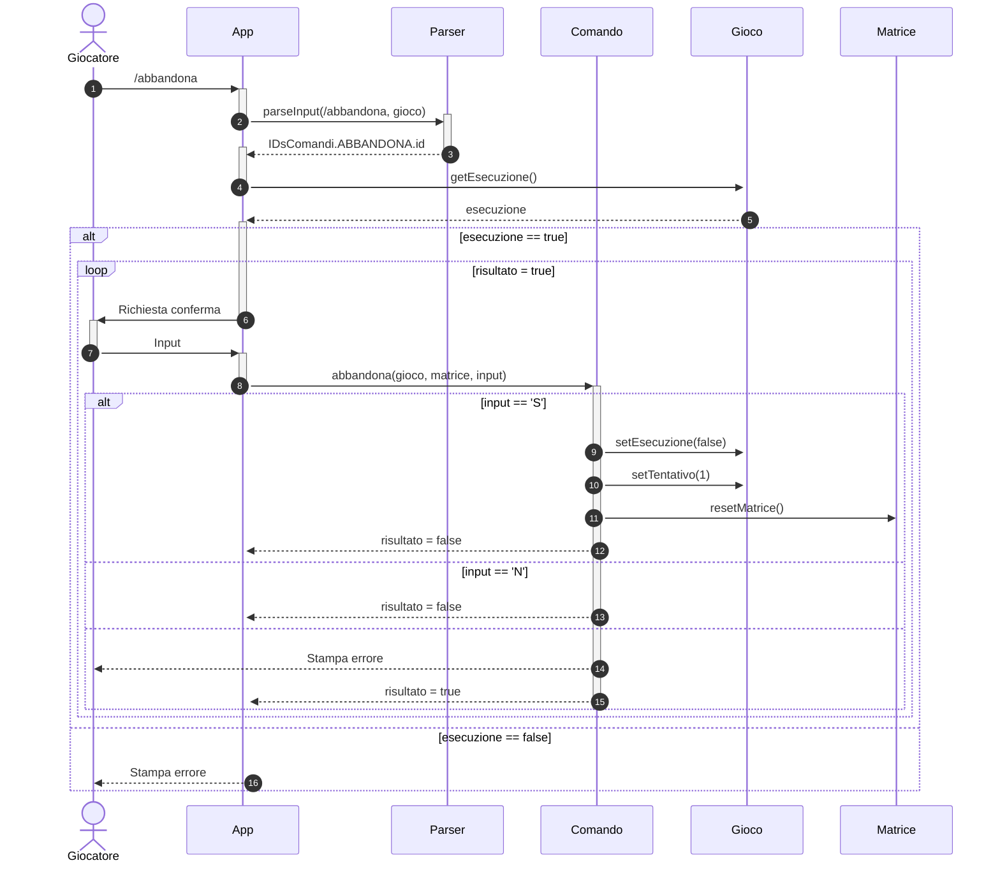
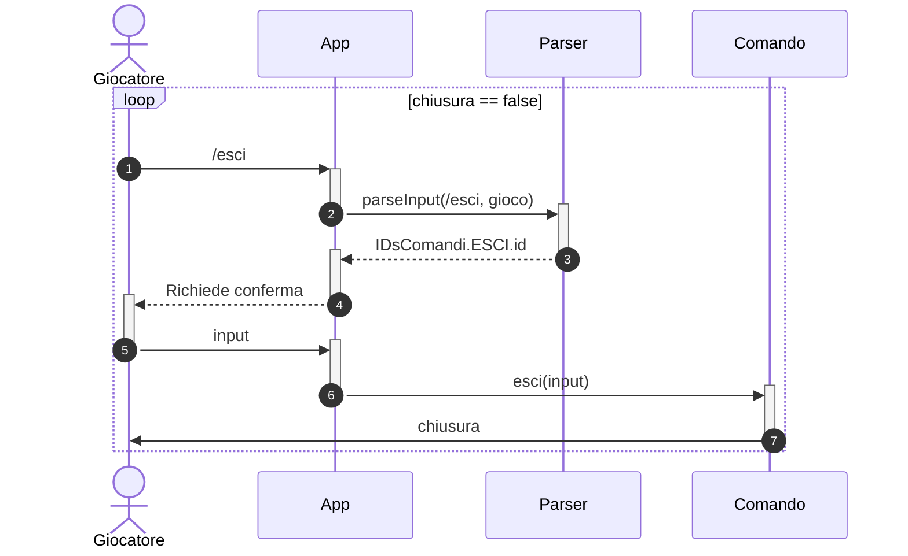
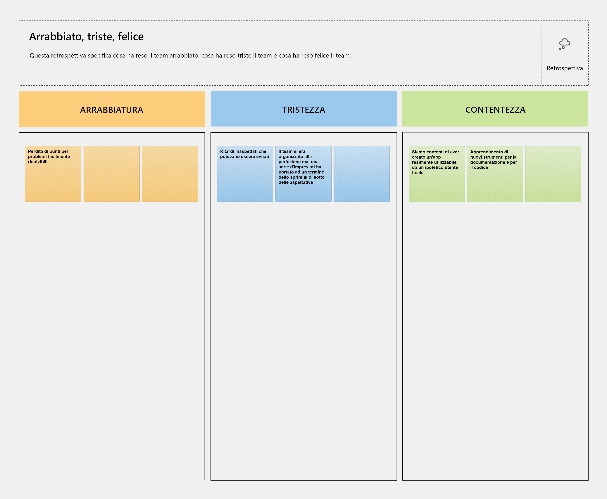

# Report
# 1. Introduzione
In questo gioco per poter vincere dovrai indovinare la parola segreta. Il gioco ti aiutera' ad indovinare la parola grazie all'uso dei colori, dove
- Grigio --> la lettera non fa parte della parola;
- Giallo --> la lettera fa parte della parola ma è in una posizione errata;
- Verde --> la lettera fa parte della parola ed è nella poszione giusta
---
Di seguito la lista dei comandi:
- /nuova < parola segreta > 
    - Per impostare una parola segreta
- /mostra 
    - Per mostrare la parola segreta
- /gioca 
    - Per iniziare una nuova partita
- /help o --help o -h 
    - Per vedere la lista dei comandi
- /abbandona 
    - Per abbandonare la partita in corso
- /esci 
    - Per uscire dall'applicazione.

# 2. Modello di dominio

# 3. Requisiti specifici
## 3.1 Requisiti funzionali
Attori: Giocatore e "Paroliere"

Le seguenti user story inizierebbero con **Come paroliere** voglio ...
- impostare una parola segreta manualmente
- mostrare la parola segreta

Le seguenti story inizierebbero con **Come giocatore** voglio ...
- mostrare l'help con elenco comandi e regole del gioco
- iniziare una nuova partita
- abbandonare una partita
- effettuare un tentativo per indovinare la parola segreta
- chiudere il gioco

## 3.2 Requisiti non funzionali
1. il container docker dell’app deve essere eseguito da terminali che supportano Unicode con encoding UTF-8 o UTF-16.

Elenco di terminali supportati
Linux:
- terminal
Mac OS
- terminal
Windows
- Powershell
- Git Bash (in questo caso il comando Docker ha come prefisso winpty; es: winpty docker -it ....)

### Comando per l’esecuzione del container
Dopo aver eseguito il comando docker pull copiandolo da GitHub Packages, il comando Docker da usare per eseguire il container contenente l’applicazione è:
```
docker run --rm -it ghcr.io/softeng2122-inf-uniba/wordle-pearl:latest
```

# 5 OO Design
## 5.1 Come Paroliere voglio impostare una parola segreta
Per semplicità assumiamo che il Giocatore e il Paroliere siano lo stesso attore.


## 5.2 Come Paroliere voglio mostrare la parola segreta 
Per semplicità assumiamo che il Giocatore e il Paroliere siano lo stesso attore.


## 5.3 Come Giocatore voglio iniziare una nuova partita 


## 5.4 Come Giocatore voglio mostrare l'help con l'elenco comandi 


## 5.5 Come Giocatore voglio effettuare un nuovo tentativo 


## 5.6 Come Giocatore voglio abbandonare la partita


## 5.7 Come Giocatore voglio uscire dal gioco


# 7 Manuale utente
In questo gioco per poter vincere dovrai indovinare la parola segreta. Il gioco ti aiutera' ad indovinare la parola grazie all'uso dei colori, dove
- Grigio --> la lettera non fa parte della parola;
- Giallo --> la lettera fa parte della parola ma è in una posizione errata;
- Verde --> la lettera fa parte della parola ed è nella poszione giusta
---
Di seguito la lista dei comandi:
- /nuova < parola segreta > 
    - Per impostare una parola segreta
- /mostra 
    - Per mostrare la parola segreta
- /gioca 
    - Per iniziare una nuova partita
- /help o --help o -h 
    - Per vedere la lista dei comandi
- /abbandona 
    - Per abbandonare la partita in corso
- /esci 
    - Per uscire dall'applicazione.

# 9 Analisi retrospettiva
## 9.1 Sprint 1
